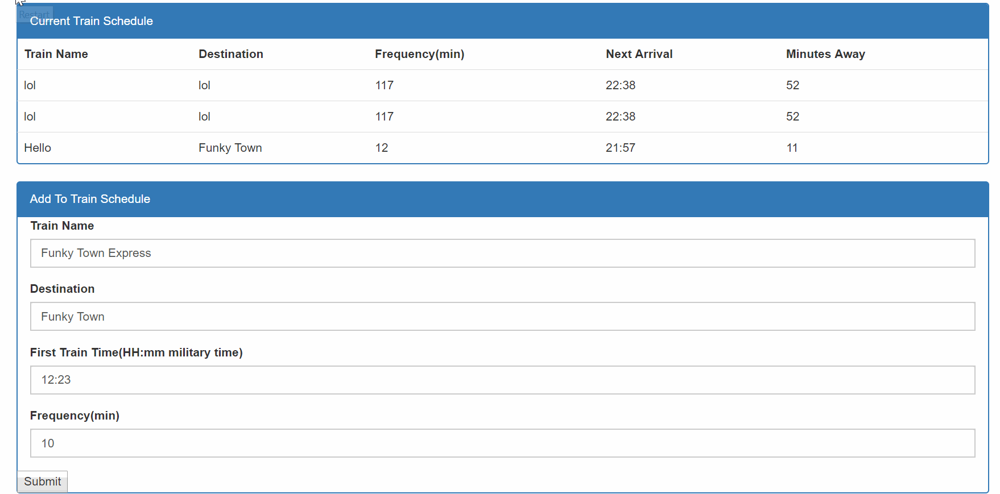

# TrainHW

This app allows you to input a train and starting time and track when the next train will come around to the station. Firebase is used to store and access the data in real time. To use it simply add in all the info needed and press submit

https://mattsald48.github.io/TrainHW/